# Contents 
- [About this Project](#about-this-project)
- [TimeWeaver](#timeweawer)
- [Installing TimeWeaver and loading data (the .ics file)](#installing-timeweaver-and-loading-data-the-ics-file)
- [First View of the Data](#first-view-of-the-data)
- [Working with Time Zones](#working-with-time-zones)
- [Weekly Occupancy Heatmap](#weekly-occupancy-heatmap)
- [Event Timeline Plot](#event-timeline-plot)
- [Event Conflicts Timeline](#event-conflicts-timeline)
- [Calendar Utilization](#calendar-utilization)
- [Filter Events](#filter-events)
- [Simulate Event](#simulate-event)
- [Occupancy Table](#occupancy-table)
- [Stress Index](#stress-index)
----

----

----
# About this Project

This project was created as part of the **Introduction to Julia** course  
in the **Data Science Master’s program at TU Dortmund University**.

- **Student:** Ulas Naki Turan  
- **Student ID:** 272473  

My package, **TimeWeaver**, analyzes calendar data (in `.ics` format) 
and provides insights into daily and weekly time usage, scheduling conflicts, and event distributions.

[↑ Back to top](#contents)
# TimeWeawer 

## _What is an `.ics` file?_

An **`.ics` file** is a standard format for calendar data exchange (iCalendar format).  
It contains information about events, their start and end times, locations, and descriptions.  

Most calendar applications (such as Apple Calendar, Google Calendar, or Outlook)  
allow you to **export your schedule** to an `.ics` file. This makes it easy to share or analyze events with other tools.

---

## Exporting from Apple Calendar (macOS)

1. Open **Apple Calendar** on macOS.  
2. Select the calendar(s) you want to export in the sidebar.  
3. From the top menu, click **File → Export → Export…**  
4. Save the file with the `.ics` extension (e.g., `mycalendar.ics`).  
5. This file can now be analyzed with TimeWeaver.

<p align="center">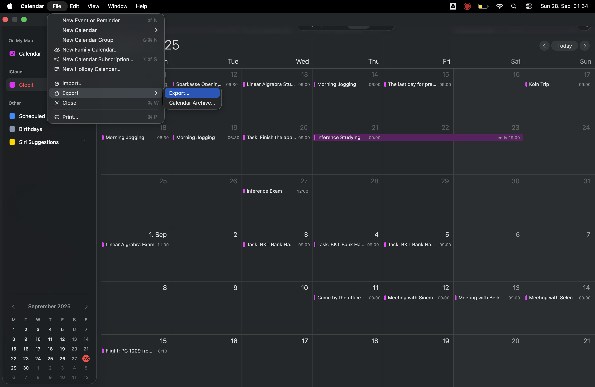</p>

[↑ Back to top](#contents)
# Installing TimeWeaver and loading data (the .ics file) 

You can install TimeWeaver in two different ways:

### 1) Install directly from GitHub
In the Julia REPL:
```julia
julia> using Pkg
julia> Pkg.add(url="https://github.com/ulasturan4/TimeWeaver.git", rev="main")
julia> using TimeWeaver, TimeZones, Dates
julia> pkgroot = Pkg.project().path
julia> ics_path = joinpath(pkgroot, "data", "mycalendar.ics")
julia> df = load_ics(ics_path)
```

### 2) Local Development Mode 

Download ZIP**, then extract it to your Desktop  
   - Or use Git in your terminal:  
     ```
     git clone https://github.com/ulasturan4/TimeWeaver.git ~/Desktop/TimeWeaver
     ```
1. **Open the project in an editor**  
   Open the extracted `TimeWeaver` folder with **VS Code** (or any editor that supports Julia).  
   In VS Code, just go to **File → Open Folder…** and choose the `TimeWeaver` folder.
   <p align="center">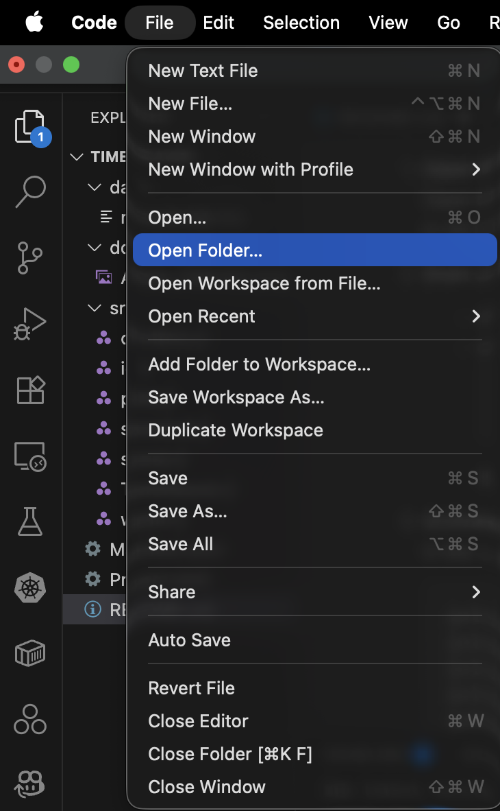</p>

2. **Activate and instantiate the environment**  
   In the Julia REPL, run:
   ```julia
   julia> cd(raw"/Users/<your-username>/Desktop/TimeWeaver")
   julia> import Pkg
   julia> Pkg.activate(".")
   julia> Pkg.instantiate()
   julia> using TimeWeaver, TimeZones, Dates
   julia> df = load_ics("data/mycalendar.ics") 
    ```

[↑ Back to top](#contents)
# First View of the Data

   In the Julia REPL, run:
   ```julia
   julia> df
   ```

<p align="center">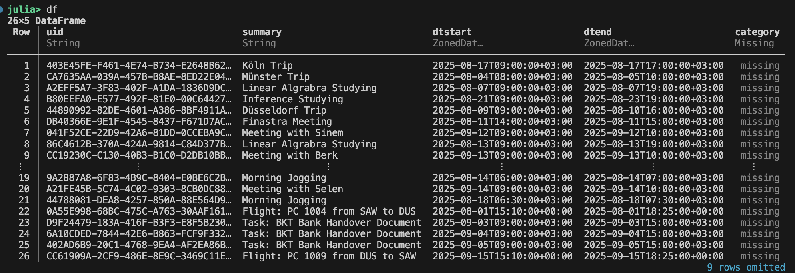</p>

[↑ Back to top](#contents)
# Working with Time Zones 

Sometimes calendar data is recorded in a different local time zone than the one you want to analyze.  
TimeWeaver allows you to **normalize** your events to a target time zone.

For example, if your events were exported in Istanbul time but you want to view them in Berlin time,  
you can use the following function:

   In the Julia REPL, run:
   ```julia
   julia> normalize_timezone!(df, tz"Europe/Berlin")
   ```
<p align="center">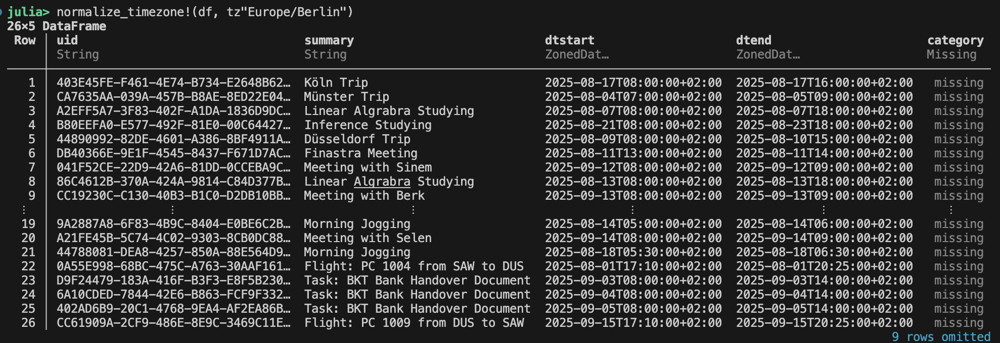</p>

----
[↑ Back to top](#contents)
# Weekly Occupancy Heatmap 

The **heatmap_hours** function generates a visual heatmap representation of occupancy patterns throughout the week, displaying busy minutes across different hours and weekdays.

In the Julia REPL, run:
```julia
julia> heatmap = heatmap_hours(df; tz=tz"Europe/Istanbul", title="Weekly Occupancy Heatmap")
```
<p align="center">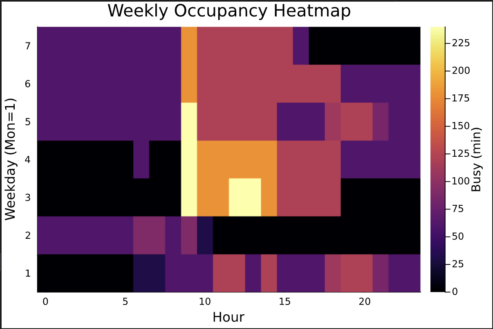</p>

## _Parameters_

- **df (DataFrame):** Input dataframe containing occupancy data
- **tz (TimeZone, optional):** Timezone for time calculations (default: UTC)
- **title (AbstractString, optional):** Custom title for the heatmap (default: "Weekly Occupancy Heatmap")

## _Output_

The function returns a heatmap visualization with:

- **X-axis:** Hours of the day (0-23)

- **Y-axis:** Weekdays (Monday=1 through Sunday=7)

- **Color intensity:** Represents busy minutes in each time slot


----

[↑ Back to top](#contents)
# Event Timeline Plot 

The **plot_timeline** function generates a Gantt-like timeline visualization of scheduled events, showing each event as a horizontal bar across its start and end time.

In the Julia REPL, run:
```julia
julia> timeline = plot_timeline(df; tz=tz"Europe/Istanbul", title="Event Timeline")
```
<p align="center">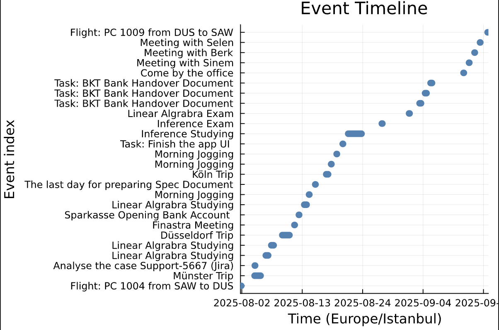</p>

## _Parameters_

- **df (DataFrame):** Input dataframe containing event data with start and end times
- **tz (TimeZone, optional):** Timezone for time calculations (default: UTC)
- **title (AbstractString, optional):** Custom title for the plot (default: "Event Timeline")

## _Output_

The function returns a timeline visualization with:

- **X-axis:** Time range (zoomed automatically to first start and last end time)
- **Y-axis:** Event index (one row per event, labeled with summary/UID)
- **Bars:** Represent each event duration, colored in blue


------
[↑ Back to top](#contents)
# Event Conflicts Timeline 

The **plot_conflicts** function highlights scheduling conflicts by marking overlapping events in red, while non-conflicting events are shown in gray.

In the Julia REPL, run:
```julia
julia> conflicts = plot_conflicts(df; tz=tz"Europe/Istanbul", title="Event Conflicts Timeline")
```
<p align="center">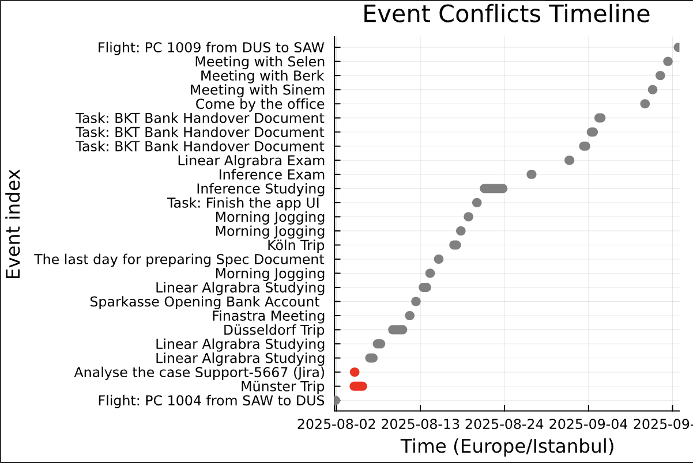</p>

## _Parameters_

- **df (DataFrame):** Input dataframe containing event data with start and end times
- **tz (TimeZone, optional):** Timezone for time calculations (default: UTC)
- **title (AbstractString, optional):** Custom title for the plot (default: "Event Conflicts Timeline")

## _Output_

The function returns a timeline visualization with:

- **X-axis:** Time range (restricted to min–max of conflicting events if any, otherwise full event range)
- **Y-axis:** Event index (one row per event, labeled with summary/UID)
- **Bars:** Red for conflicting events, gray for non-conflicting events

[↑ Back to top](#contents)
# Calendar Utilization 

The **`utilization`** function aggregates calendar events into daily, weekly, monthly, or custom-sized buckets and computes descriptive statistics such as total busy minutes, event counts, and average durations.

In the Julia REPL, run:
```julia
julia> util_d = utilization(df; tz=tz"Europe/Istanbul", by=:day)

julia> util_w = utilization(df; tz=tz"Europe/Istanbul", by=:week)

julia> util_m = utilization(df; tz=tz"Europe/Istanbul", by=:month)

julia> util_3d = utilization(df; tz=tz"Europe/Istanbul", by=Day(3))
```

<p align="center">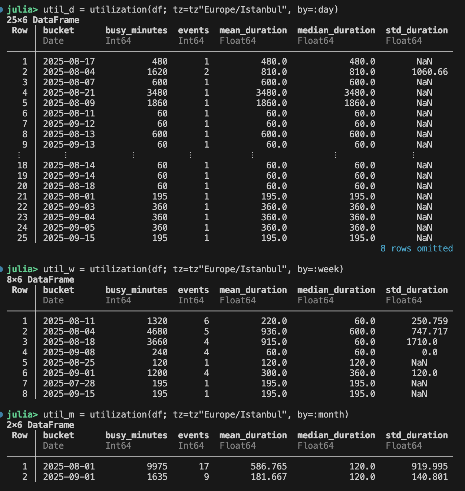</p>

## _Parameters_

- **df (DataFrame):** Input dataframe containing event data with `:dtstart` and `:dtend`  
- **tz (TimeZone, optional):** Target timezone for bucketing (default: UTC)  
- **by (Symbol or Period, optional):** Defines aggregation buckets  
  - `:day` — aggregates by calendar day  
  - `:week` — aggregates by week (starting Monday)  
  - `:month` — aggregates by calendar month  
  - `Period` (e.g., `Day(3)`, `Week(2)`) — fixed-size windows  

## _Output_

The function returns a `DataFrame` with the following columns:

- **:bucket** — The bucket anchor (Date or DateTime)  
- **:busy_minutes** — Total occupied minutes in the bucket  
- **:events** — Number of events in the bucket  
- **:mean_duration** — Average event duration (minutes)  
- **:median_duration** — Median event duration (minutes)  
- **:std_duration** — Standard deviation of event duration (minutes)  

[↑ Back to top](#contents)
# Filter Events 

The **`filter_events`** function extracts a subset of events from a calendar dataframe based on multiple criteria such as date range, categories, text search, weekdays, or hours.

In the Julia REPL, run:
```julia
julia> mon_wed = filter_events(df; tz=tz"Europe/Istanbul", weekdays=[1,2,3], hours=9:17)

julia> s = ZonedDateTime(2025,8,1,0,0,0,tz"Europe/Istanbul")
julia> e = s + Day(7)
julia> d2 = filter_events(df; tz=tz"Europe/Istanbul", text="Linear", range=(s,e))
```

<p align="center">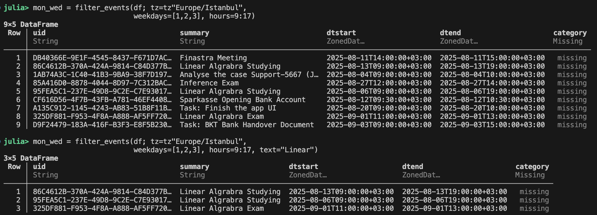</p>

## _Parameters_

- **df (DataFrame):** A calendar dataframe containing at least `:uid`, `:summary`, `:dtstart`, and `:dtend`.  
- **tz (TimeZone, optional):** Target timezone used for evaluating weekdays/hours and ranges (default: UTC).  
- **range (Tuple or nothing, optional):** Time window `(start, stop)`; keeps events intersecting with the range.  
- **categories (Vector or nothing, optional):** Filters events whose `:category` is in this list.  
- **text (String or nothing, optional):** Case-insensitive substring filter on event summaries.  
- **weekdays (Vector{Int} or nothing, optional):** Filters events starting on given weekdays (1=Mon … 7=Sun).  
- **hours (Vector{Int} or nothing, optional):** Filters events starting at specific hours (0–23).  

## _Output_

The function returns a filtered `DataFrame` preserving the input schema.  

- Only events matching **all specified conditions** are kept.  
- If no conditions are given, the original dataframe is returned unchanged.  

[↑ Back to top](#contents)
# Simulate Event

The **`simulate_event`** function tests whether adding a hypothetical event to the calendar would create any scheduling conflicts and returns the set of impacted events.

In the Julia REPL, run:
```julia
julia> start = ZonedDateTime(2025, 8, 12, 14, 0, 0, tz"Europe/Istanbul")
julia> stop  = start + Minute(45)
julia> res = simulate_event(df, start, stop; summary="WhatIf: Gym")
julia> res.would_conflict      # true/false
```
<p align="center">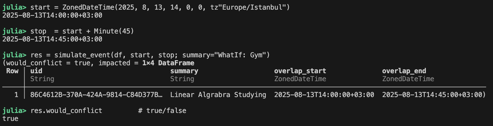</p>

## _Parameters_

- **df (DataFrame):** Calendar dataframe containing at least `:uid`, `:summary`, `:dtstart`, and `:dtend` of type `ZonedDateTime`.
- **start (ZonedDateTime):** Proposed event start (inclusive in the half‑open interval `[start, stop)`).
- **stop (ZonedDateTime):** Proposed event end (exclusive in the half‑open interval `[start, stop)`).
- **summary (AbstractString, optional):** Label used for the hypothetical event in outputs (default: `"WhatIf"`).

## _Output_

Returns a `NamedTuple`:
- **would_conflict::Bool** — `true` if the proposed event overlaps with any existing event (i.e., there exists an event with `dtend > start && dtstart < stop`), else `false`.
- **impacted::DataFrame** — Subset of overlapping events with columns:
  - `:uid` — Identifier of the conflicting event
  - `:summary` — Summary/title of the conflicting event
  - `:overlap_start` — Overlap start time
  - `:overlap_end` — Overlap end time

[↑ Back to top](#contents)
# Occupancy Table 

The **`occupancy_table`** function computes occupied minutes per bucket, either per **day** or per **(weekday, hour)**.

In the Julia REPL, run:
```julia
julia> occ_day  = occupancy_table(df; by=:day,  tz=tz"Europe/Istanbul")
julia> occ_hour = occupancy_table(df; by=:hour, tz=tz"Europe/Istanbul")
```
<p align="center">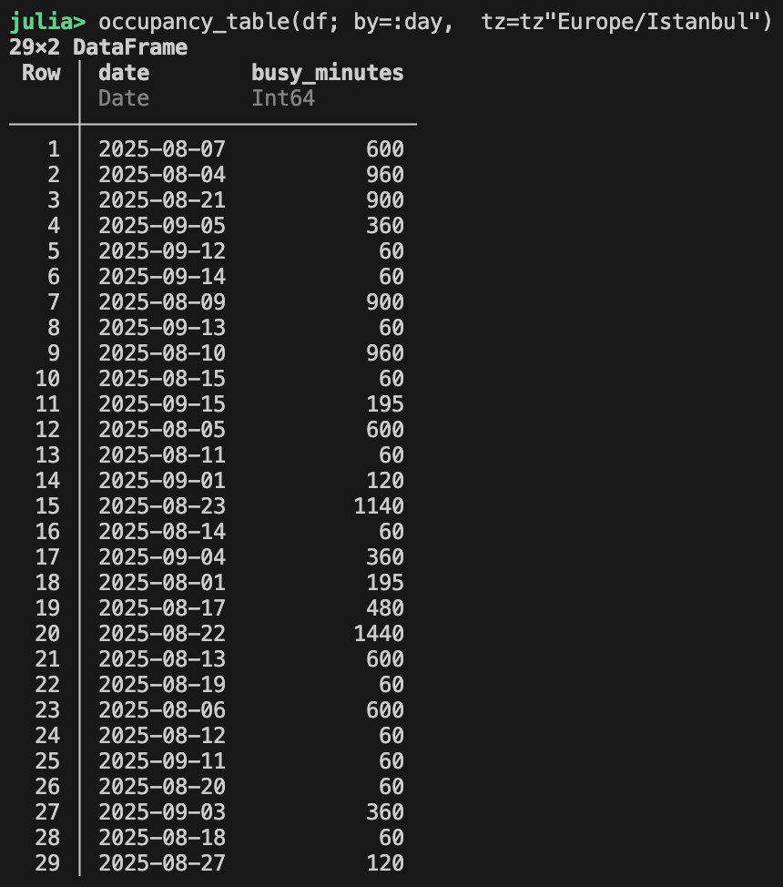</p>

## _Parameters_

- **df (DataFrame):** Calendar dataframe with `:dtstart` and `:dtend` (ZonedDateTime)  
- **by (Symbol, optional):** Aggregation level — `:day` or `:hour` (default: `:day`)  
- **tz (TimeZone, optional):** Target timezone for bucketing (default: UTC)

## _Output_

Returns a `DataFrame` of occupied minutes:

- For `by = :day` → columns: **`:date`**, **`:busy_minutes`**  
- For `by = :hour` → columns: **`:weekday`** (1=Mon … 7=Sun), **`:hour`** (0–23), **`:busy_minutes`**  


---
[↑ Back to top](#contents)
# Stress Index 

The **`stress_index`** function maps **busy minutes** to a **0–100 stress score** per bucket using a saturating function.

In the Julia REPL, run:
```julia
julia> stress_day  = stress_index(df; by=:day,  tz=tz"Europe/Istanbul")
julia> stress_hour = stress_index(df; by=:hour, tz=tz"Europe/Istanbul")
```
<p align="center">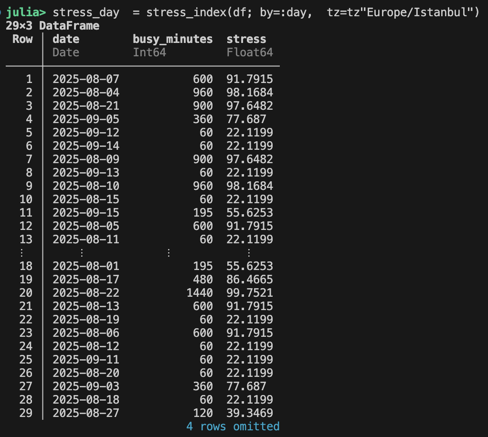</p>

## _Parameters_

- **df (DataFrame):** Calendar dataframe with `:dtstart` and `:dtend` (ZonedDateTime)  
- **by (Symbol, optional):** Aggregation level — `:day` or `:hour` (default: `:day`)  
- **tz (TimeZone, optional):** Target timezone for bucketing (default: UTC)

## _Output_

Returns a `DataFrame` that includes the original occupancy columns for the chosen `by` plus:

- **`:busy_minutes`** — Occupied minutes in the bucket  
- **`:stress`** — Saturated stress score in `[0, 100]`, computed as:
  
   `stress = 100 * (1 - exp(-busy_minutes / 240))`
  
Higher **busy_minutes** yield scores that asymptotically approach **100**, while shorter workloads stay closer to **0**.

